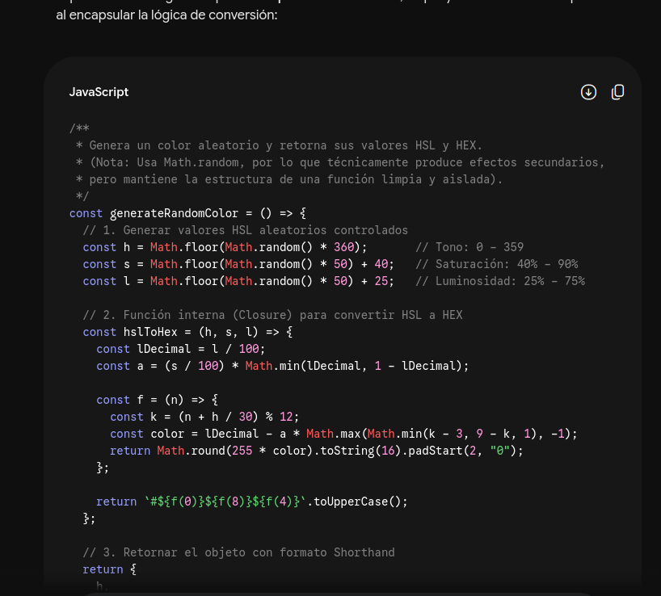
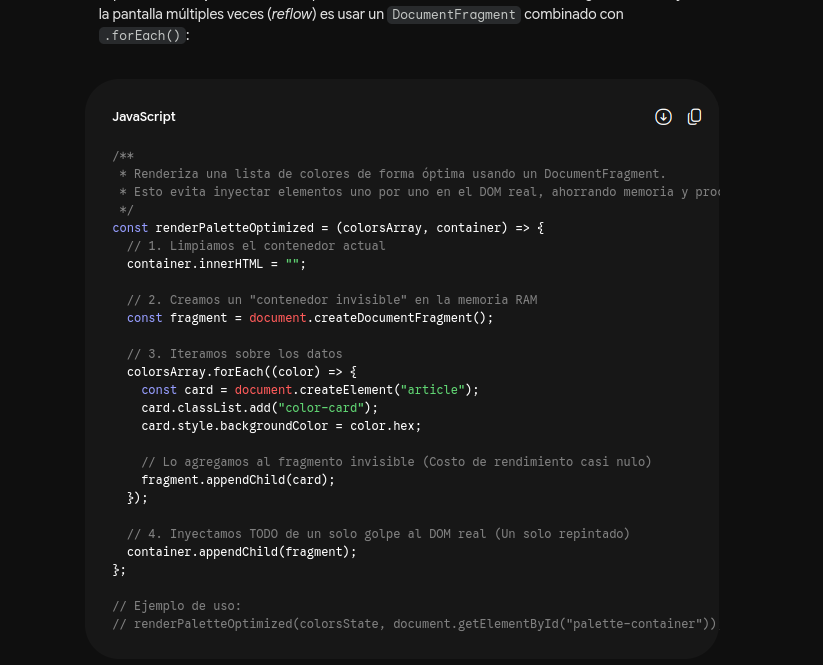
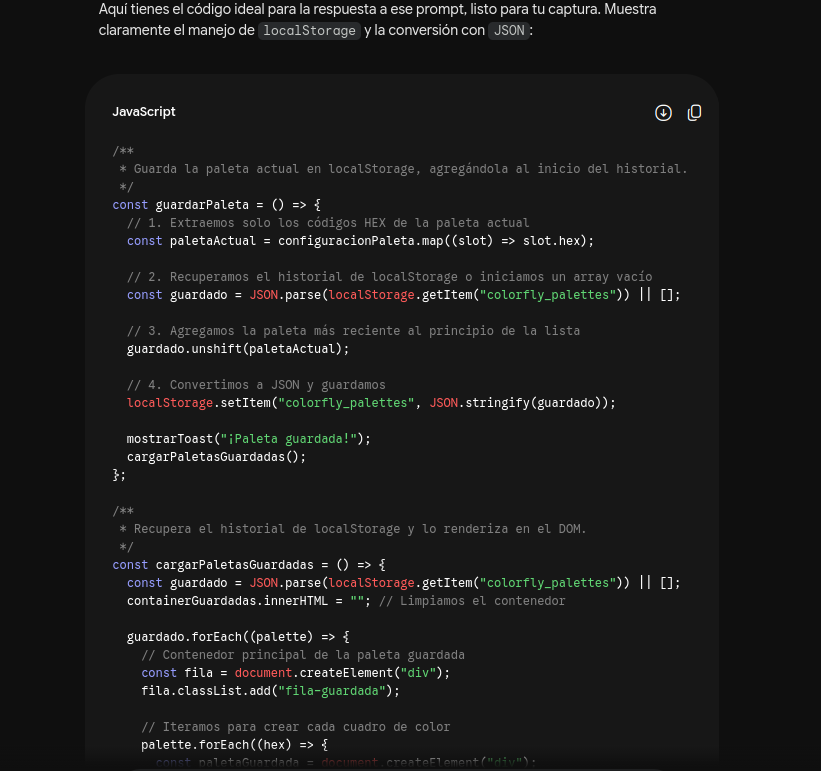

## 🤖 Uso de Inteligencia Artificial (IA)

Como este es un proyecto de aprendizaje, utilicé la Inteligencia Artificial principalmente como un mentor personal. Mi objetivo era mantener una mentalidad enfocada en armar el mejor producto final posible, y la IA fue como mi compañero de equipo para lograrlo. 

Específicamente, me apoyé en la IA para:

*   **Mentoría y guía:** Me ayudó a rebotar ideas, entender mejor cómo estructurar el proyecto y aplicar buenas prácticas mientras sigo aprendiendo sobre desarrollo web.
*   **Las matemáticas de los colores:** Fue una ayuda enorme para destrabarme con la lógica matemática y los algoritmos detrás de la conversión de colores (como pasar de formatos HEX a HSL), ¡que tiene su truco!
*   **Resolución de problemas:** Cuando me atascaba con algún bug, la usé para analizar el problema, encontrar alternativas y, sobre todo, entender la solución para no volver a cometer el mismo error.

En resumen, usé la IA no para que hiciera el trabajo por mí, sino como una herramienta colaborativa para aprender más rápido y poder enfocarme en construir una aplicación funcional y bien hecha.

### 💬 Ejemplo de interacción

Para dar un poco de contexto sobre cómo fue esta mentoría, aquí dejo un ejemplo real de una de mis consultas cuando estaba armando la lógica de la aplicación:

**Mi prompt:**
> *"Escribe una función pura en JavaScript moderno que genere un color aleatorio en formato HSL y retorne un objeto con su valor HSL y su conversión a HEX."*

**La respuesta (y código base) que me ayudó a entender la lógica:**

También utilicé la IA para consultar sobre buenas prácticas de rendimiento y manipulación del DOM, asegurándome de que la aplicación sea eficiente:

**Mi prompt:**
> *"Tengo una lista de objetos de colores. ¿Cómo uso el método .map() o .forEach() para renderizarlos en el DOM sin saturar la memoria?"*

**La explicación y solución:**

Para darle una mejor experiencia al usuario y hacer la aplicación más robusta, utilicé la IA para guiarme en la implementación de persistencia de datos. Así me aseguré de que el historial de paletas no se pierda al recargar la página:

**Mi prompt:**
> *"Escribe las funciones necesarias en JavaScript para guardar el estado actual de la paleta en el localStorage del navegador, y otra función para recuperar y renderizar ese historial en el DOM. Asegúrate de guardar los colores en formato JSON y de que la paleta más reciente se agregue al principio de la lista"*

**La explicación y solución:**

### ⚡ Consultas rápidas y sintaxis

Finalmente, también aproveché la IA como una guía de referencia rápida para resolver dudas más simples del día a día. La utilicé bastante para recordar la sintaxis exacta de algunos métodos y para ayudarme a razonar qué estructura o lógica debía llevar cierto bloque de código. ¡Básicamente fue como tener un manual interactivo siempre a la mano para programar de forma más fluida!